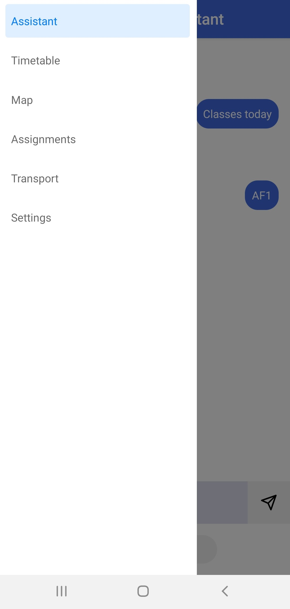
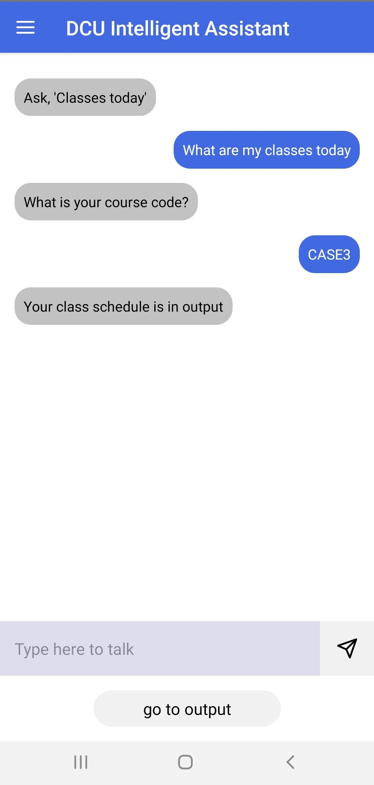
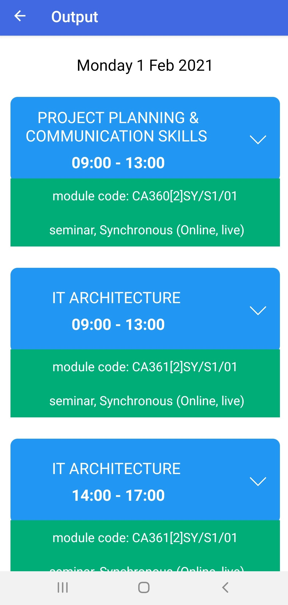
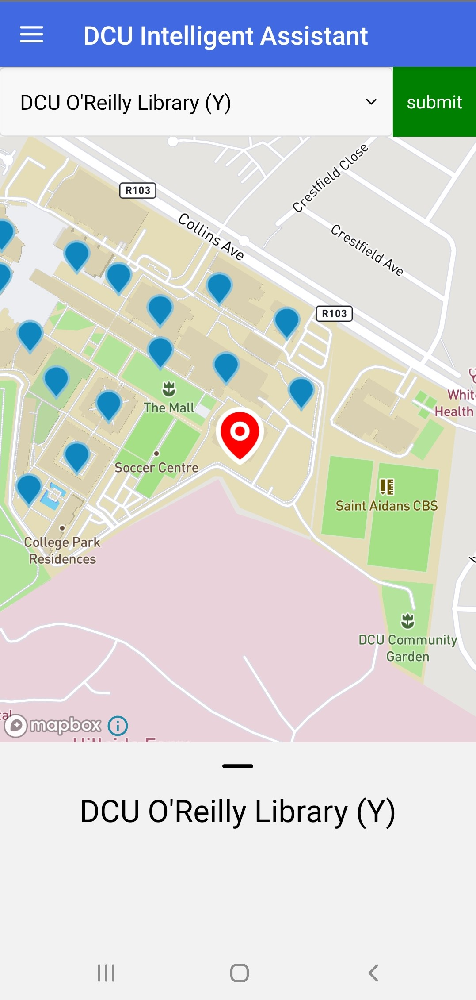

# DCU Intelligent Assistant

## Overview

DCU Intelligent Assistant is an android app which provides useful college services including:
- the ability to find class timetables using a course code and date
- an interactive map of DCU to search for buildings in DCU
- an assignments page for creating and saving reminders for assignments
- a transport page for finding bus timetables for bus stops near DCU or for any bus number

All of these features can be accessed through an AI chatbot. For example, sending the message "What are my classes today?" to it will open up a page displaying your class timetable.

## Screenshots

  
  
   
  

## Installation guide

### 1. Install App from the Google Play Store

[Play Store link](https://play.google.com/store/apps/details?id=com.chatbot2)

### 2. Run the App From this Repository

#### Requirements

* see the React Native CLI Quickstart guide at https://reactnative.dev/docs/environment-setup

#### How to Run the App

1. in the `chatbot2` directory, run `yarn` or `npm install` to install all necessary dependencies.
2. start an emulator or connect a physical device (see: https://reactnative.dev/docs/environment-setup)
3. run `yarn start` or `npx react-native start`
4. in another terminal, run `yarn android` or `npx react-native run-android`
5. the app will run on the emulator or physical device

## Technologies

React Native, NodeJS, Javascript, PostreSQL

## About
This is my 3rd year project which I created with Darragh McGonigle, another 3rd year computer science student at DCU.
